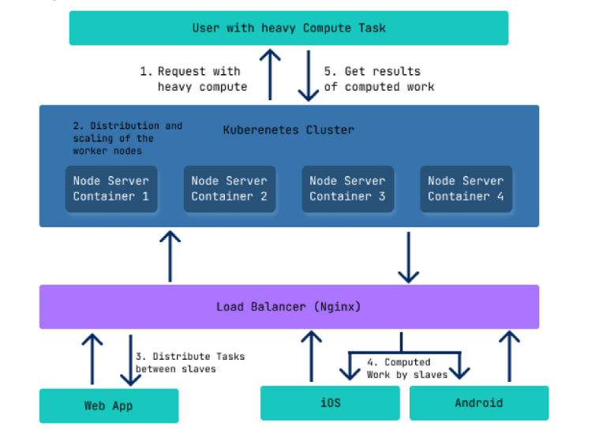
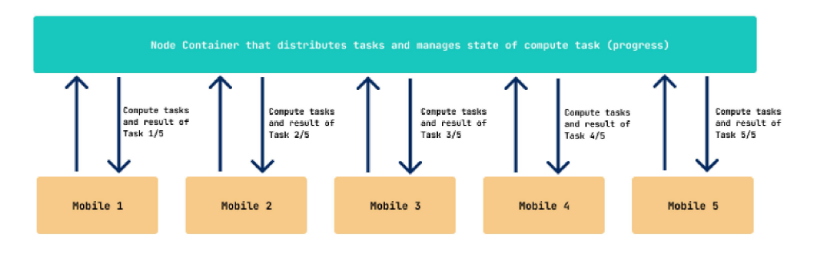

# Project Crumbler

> An proof-of-concept of oppurtunistic computing which also uses cluster computing

This serves as a project as part of the Cloud Computing Course at my university

## Architecture







## Installation

```bash
git clone https://github.com/DarthBenro008/crumbler
```

### Cloud Central Server

To install the central server, use the following:

```bash
cd crumbler_central_node
yarn 
yarn start
```

You will get an message that:

```bash
Server started succesfully in port 3000
```

#### Using Dockerfile

Run the following commands

```bash
cd crumbler_central_node
docker build . -t crumbler_node:latest
docker run -p 3000:3000 crumbler_node:latest
```

### Mobile App


#### Building

It is recommended that you run Gradle with the `--daemon` option, as starting
up the tool from scratch often takes at least a few seconds. You can kill the
java process that it leaves running once you are done running your commands.

Tasks work much like Make targets, so you may concatenate them. Tasks are not
re-done if multiple targets in a single command require them. For example,
running `assemble install` will not compile the apk twice even though
`install` depends on `assemble`.

##### Clean

 gradle clean

##### Debug

This compiles a debugging apk in `build/outputs/apk/` signed with a debug key,
ready to be installed for testing purposes.

 gradle assembleDebug

You can also install it on your attached device:

 gradle installDebug

##### Release

This compiles an unsigned release (non-debugging) apk in `build/outputs/apk/`.
It's not signed, you must sign it before it can be installed by any users.

`gradle assembleRelease`

##### Test

Were you to add automated java tests, you could configure them in your
`build.gradle` file and run them within gradle as well.

`gradle test`


## Results


Why calculation of prime numbers?

We are using Sieve of erasothaneses to calculate prime numbers upto high like 2^25. We are doing this using web-socket and power of cluster computing, 

we were able to achieve a whooping 50% efficiency than runnning it an normal node.